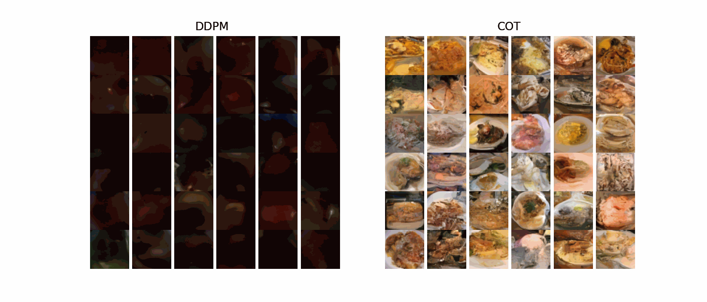
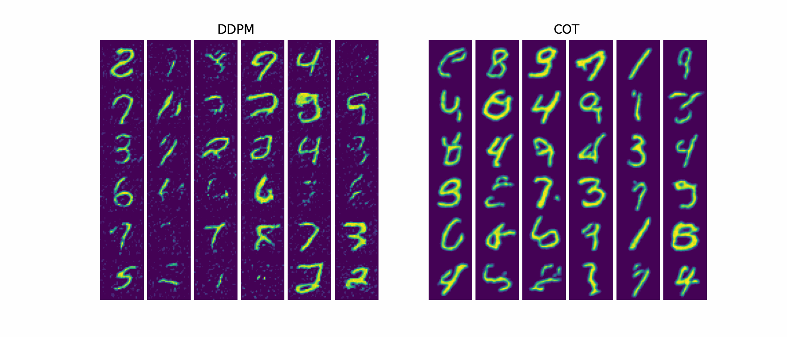
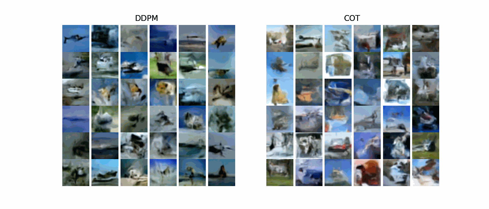

# Generative AI empowered by Collisional Optimal Transport

This repository demonstrates the application of the collisional optimal transport method (COT) published in

- Sadr, Mohsen, and Hossein Gorji. "Collision-based Dynamics for Multi-Marginal Optimal Transport.", 2025, arXiv preprint at [arXiv:2412.16385](https://doi.org/10.48550/arXiv.2412.16385).

for calibrating diffusion models used in Generative AI. 

Here, we compare our approach against the well-known Denoising Diffusion Probabilistic Models (DDPM)

- Ho, Jonathan, Ajay Jain, and Pieter Abbeel. "Denoising diffusion probabilistic models." Advances in neural information processing systems 33 (2020): 6840-6851, [arXiv.2006.11239](https://doi.org/10.48550/arXiv.2006.11239).

in generating images of commonly known datasets.

As a shocase, let us consider both models only with 10 epochs over a subset of the datasets (10k data points). The trained model is then tested to generate new images post-training. In the case of the [Food101](https://docs.pytorch.org/vision/main/generated/torchvision.datasets.Food101.html) we obtain 

[MNIST](https://docs.pytorch.org/vision/main/generated/torchvision.datasets.MNIST.html)

and [CIFAR10](https://docs.pytorch.org/vision/main/generated/torchvision.datasets.CIFAR10.html)

For training, please see examples in the `training/` directory.

For testing the trained model, please see examples in `testing/` directory.

