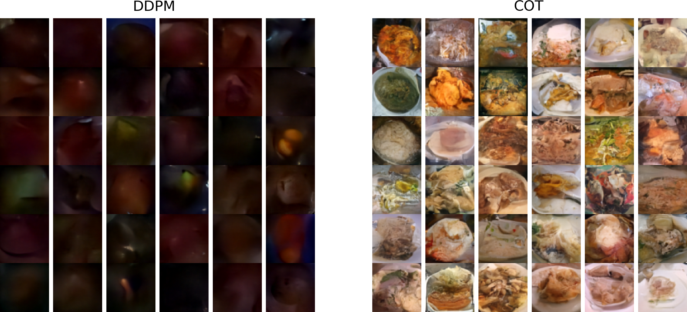
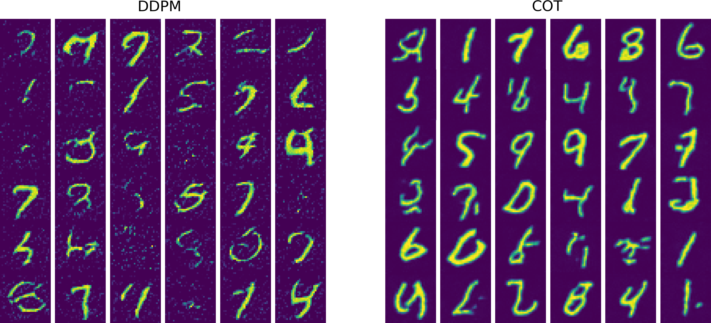
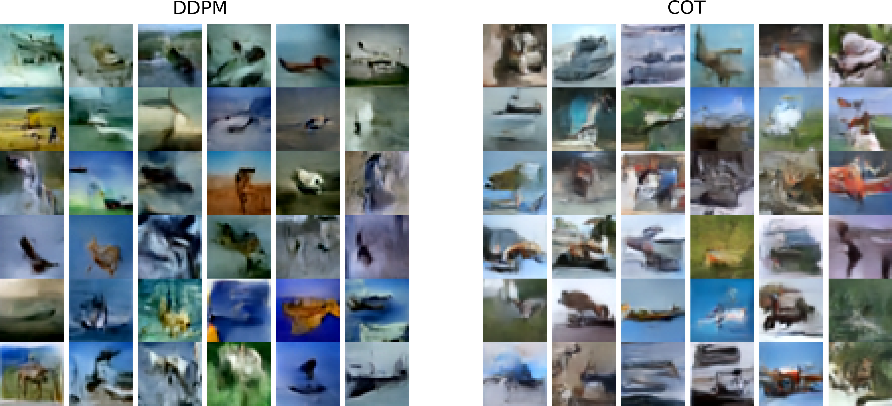

# Generative AI Empowered by Optimal Transport

This repository demonstrates the application of the collisional optimal transport method published in

- Sadr, Mohsen, and Hossein Gorji. "Collision-based Dynamics for Multi-Marginal Optimal Transport.", 2025, arXiv preprint at [arXiv:2412.16385](https://doi.org/10.48550/arXiv.2412.16385).

for calibrating diffusion models used in Generative AI. 

As an example, we compare our approach with the well-known Denoising Diffusion Probabilistic Models (DDPM)

- Ho, Jonathan, Ajay Jain, and Pieter Abbeel. "Denoising diffusion probabilistic models." Advances in neural information processing systems 33 (2020): 6840-6851, [arXiv.2006.11239](https://doi.org/10.48550/arXiv.2006.11239).

in generating images of MNIST, CIFAR10, and Food101.

For example, in the case of the [Food101](https://docs.pytorch.org/vision/main/generated/torchvision.datasets.Food101.html) dataset, after only 10 epochs, the Generative model trained on optimally paired samples of the normal distribution can generate more reasonable images compared to the DDPM counterpart.

Similarly, for [MNIST](https://docs.pytorch.org/vision/main/generated/torchvision.datasets.MNIST.html)

and [CIFAR10](https://docs.pytorch.org/vision/main/generated/torchvision.datasets.CIFAR10.html)

For training, please see examples in the `training/` directory.

For testing the trained model, please see examples in `testing/` directory.

